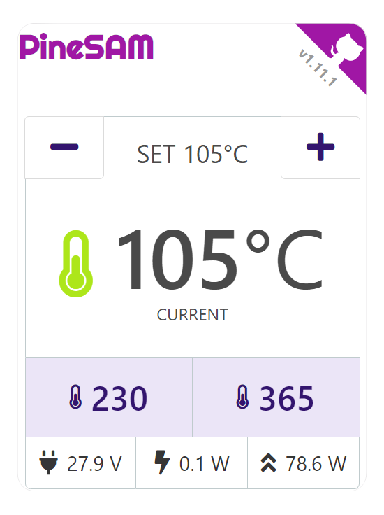
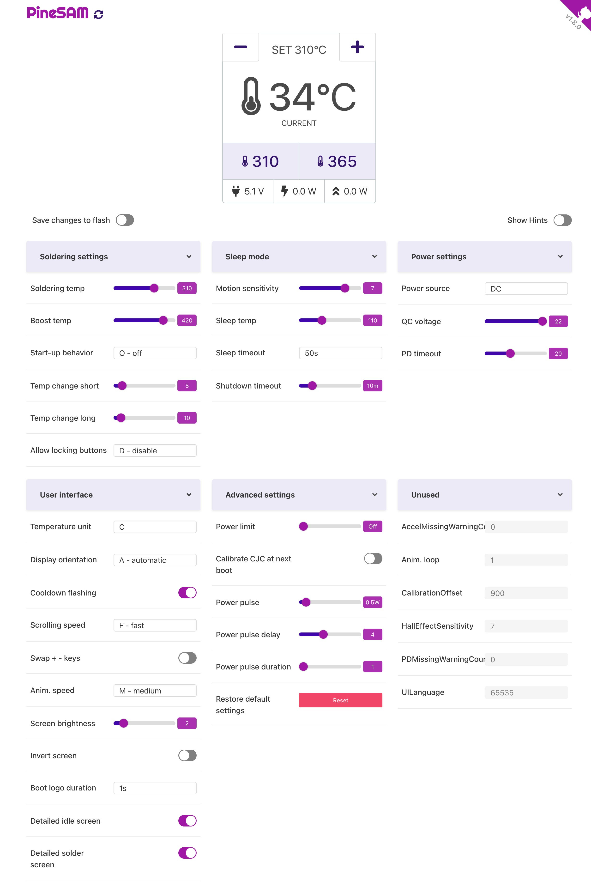

[](https://github.com/builder555/PineSAM/wiki/PineSAM)
[](https://github.com/builder555/PineSAM#abacus-contributors-welcome)
[](https://github.com/builder555/PineSAM/releases/)
[](https://github.com/builder555/PineSAM/releases/latest)

<br><br>
 <br clear="left" />
---
<br>


#### PineSAM = Pinecil Settings and Menus

Why focus on soldering when you can play with the settings instead? With this app you have full control over your new shiny Pinecil V2 from your computer using bluetooth.

**NB**: No special browser BLE GATT or flags required and works on all major OS/devices.

**NB**: This app needs the python backend to run on a computer, it CANNOT run entirely in the browser like Joric's UI.

<details>
  <summary>
    
#### Full settings view

  </summary>

 

</details>
<br clear="right"/>

# 💫 Features

- [x] Automatically detect Pinecil V2 over BLE.
- [x] Control all settings on the device.
- [X] Save to Flash: toggle to save changes directly onto Pinecil (leave off unless actively changing settings).
- [X] Work HUD main screen with: Set °C/°F `[+][-]` buttons, live tip °C/°F updates, peak watts, live watts, input voltage.
- [X] Preset buttons to allow quick change of user defined temperatures (PineSAM extra feature not available directly inside Pinecil).
- [X] Backend runs locally on all major platforms/OS while the user interface runs on your favorite browser.
- [X] Usage details in [PineSAM wiki](https://github.com/builder555/PineSAM/wiki).

## Platforms
 | System  | MacOS | Linux | Windows | iOS | Android|
 | :-----: | :-----: | :---: | :---: | :-: | :----: |
 | UI      |:heavy_check_mark:|:heavy_check_mark:|:heavy_check_mark:|:heavy_check_mark:|:heavy_check_mark:|
 | backend |:heavy_check_mark:|:heavy_check_mark:|:heavy_check_mark:|
<br>

# :desktop_computer: Install Options

## I. Using pre-made binaries

1. Binary packages do not require installation of python or node.js
2. Download latest [release](https://github.com/builder555/PineSAM/releases/latest) version for your specific OS (Mac, Linux, Windows).
3. **Mac/Linux**: extract and run `./start.sh` in terminal.

   * On MacOS, http://localhost:8080/ opens in your browser automatically.
   * Some Linux distros may need http://localhost:8080/ opened manually.
   * Usage guide [here](https://github.com/builder555/PineSAM/wiki).

4. **Windows**: 
   * right click on the zip, properties> general, check box to Unblock, then extract ([reference](https://github.com/builder555/PineSAM/discussions/106#discussion-4960445)).
   * Run [powershell](https://learn.microsoft.com/en-us/powershell/scripting/install/installing-powershell-on-windows?view=powershell-7.3) as admin, cd to the pinesam folder and `.\start.ps1`
   * Allow any windows pop-up warnings about "serve.exe" and "main_sever.exe".
   * If you get errors in powershell, set the permissions to RemoteSigned to allow scripts ([reference](https://lazyadmin.nl/powershell/running-scripts-is-disabled-on-this-system/)).
     * ```C:\> Set-ExecutionPolicy RemoteSigned```
   * Browser will automatically open http://localhost:8080
   * Usage guide [here](https://github.com/builder555/PineSAM/wiki).

## II. Install the Dev version (Source-all-_.zip)

This is the same PineSam as the pre-made binaries. Install this if there is an issue with the binaries.  
For the backend script, first install:
- [git](https://git-scm.com/book/en/v2/Getting-Started-Installing-Git)
- [python 3](https://www.python.org/downloads/) (tested with 3.10/3.11)
- [pipenv](https://pipenv.pypa.io/en/latest/installation/)
- [node+npm](https://nodejs.org/en/download/)
<details>
  <summary>
  
  ### Mac/Linux install
  </summary>
  
#### Setup
Install all packages linked above first.

```shell
git clone https://github.com/builder555/PineSAM
cd PineSAM
chmod +x setup-dev.sh
chmod +x run-dev.sh
./setup-dev.sh
```

#### Run
```shell
./run-dev.sh
# press CTRL+C in the terminal window to stop
```
* On a Mac http://localhost:8080 will open in your browser automatically.
* Some Linux distros may need http://localhost:8080 opened manually. Debian12 hints [here](https://github.com/builder555/PineSAM/discussions/47#discussion-4884758).

</details>

<details>
  <summary>
  
### Windows dev install
  </summary>

#### Install
Install the packages linked above for the backend script. Skip to 4 if you did this already.

1. Python install notes
    * Check "Add python.exe to PATH" and select "Customize Installation"
    * Check "Add Python to environment variables" option
    * Screenshots of options to select [are here](https://github.com/builder555/PineSAM/discussions/7#discussion-4862766).
2. Install [NodeJS here](https://nodejs.org/en/download/), accept all prompts to add packages during install including a prompt in the terminal that opens.
3. After installing packages listed for backend script ([reference](https://github.com/builder555/PineSAM/issues/131#issuecomment-1489711241)), go to System Environment variables to check paths ([image](https://github.com/builder555/PineSAM/discussions/130#discussion-5011624)).
4. Download the Source-all-__.zip from the [latest release](https://github.com/builder555/PineSAM/releases/latest).
5. If the zip has an Unblock option, then unblock and extract ([example](https://github.com/builder555/PineSAM/discussions/106#discussion-4960445)).
6. Run powershell as administrator, set permissions to RemoteSigned ([image here](https://github.com/builder555/PineSAM/discussions/106)).
```shell
# setting this one time in powershell normally persists on reboots.
C:\Set-ExecutionPolicy RemoteSigned
```
#### Run
1. change directory, `cd` into the PineSAM folder that was extracted above.
```shell
.\setup-dev.bat   # only need to run this one time for each new version
.\run-dev.bat     # run this command every time to start PineSAM (do not need to run as admin)
```
</details>
<div style="clear:both;">&nbsp;</div>

## :signal_strength: Remote access

You can access the settings remotely once the app is running on the main PC/laptop.

* Find the [local IP address](https://lifehacker.com/how-to-find-your-local-and-external-ip-address-5833108) of the device running the app.
* open `http://<ip-address>:8080/` on the second device on the same network (e.g., a phone).
* Pinecil needs to be within BLE range of the computer running the PineSAM app.

## 🚧 Known issues
1. bleak causes Python to crash on Mac: https://github.com/hbldh/bleak/issues/768
    * possible solution: give access to iTerm (or whichever terminal you use) to Bluetooth in Settings

2. Pinecil not detected
    * possible reason: you paired your Pinecil using system settings. solution: unpair it from all other places.  
    * possible reason: using older firmware (below 2.21). solution: [flash](https://github.com/Ralim/IronOS/discussions/1518#discussioncomment-4866637) current [BLE firmware](https://github.com/Ralim/IronOS/suites/11876815030/artifacts/621223733); below IronOS 2.21 only BETA versions will work with PineSAM.
    
3. main_server script terminal crashes on start of script: incompatible version of IronOS, check/update firmware see above.

4. Windows Powershell issue
    * windows by default does not allow any scripts to run in powershell. Make sure the zip file property is _Unblock_ ([reference](https://github.com/builder555/PineSAM/discussions/106#discussion-4960445)) and set powershell to remotesigned with:<br/>
    `set-executionpolicy remotesigned`
    * check that windows has not reset the permissions in powershell with `Get-ExecutionPolicy` and change it back to `RemoteSigned` if needed ([reference](https://lazyadmin.nl/powershell/running-scripts-is-disabled-on-this-system/)).
  
5. See the [Discussions](https://github.com/builder555/PineSAM/discussions) section for install hints and solutions to some common issues.
6. PineSAM usage [instructions here](https://github.com/builder555/PineSAM/wiki).
7. Something else: [open an issue](https://github.com/builder555/PineSAM/issues).
<br>

## :abacus: Contributors Welcome
- Please fork the repo, and submit Pull Requests using the `/dev` branch

## 🛠️ Running Unit tests

```shell
# run inside 'backend' directory:
pipenv run test
```

## :book: References

- [Pinecil](https://wiki.pine64.org/wiki/Pinecil) - The Pinecil Wiki page
- [IronOS](https://github.com/Ralim/IronOS) - The OS running on this soldering iron
- [Pinecil Web UI](https://github.com/joric/pinecil) - A neat web-based UI, requires bluetooth browser support
- [Pinecil Authenticity Checker](https://pinecil.pine64.org/) - almost all AliExpress Pinecils are fake, check your V2!

