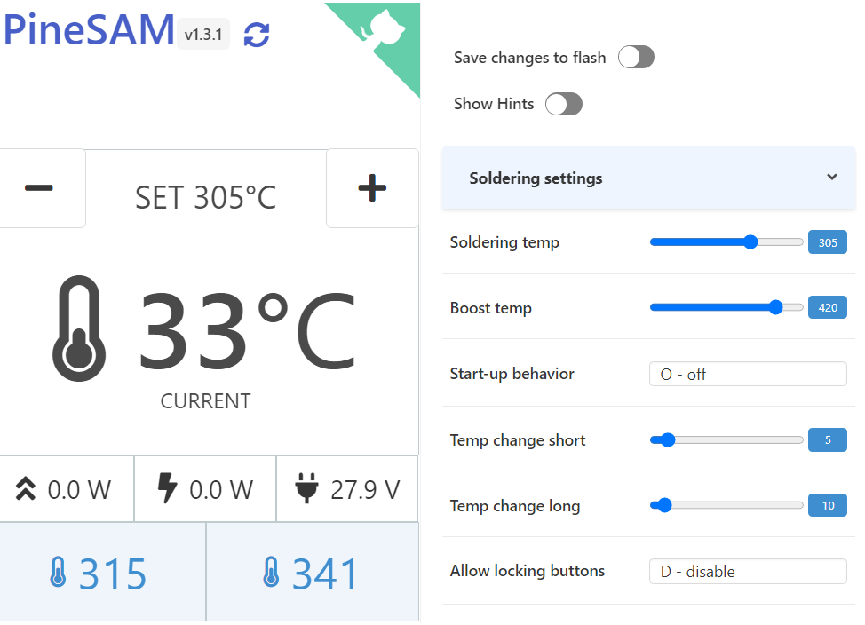

[](https://hits.seeyoufarm.com)


# PineSAM



PineSAM = (Pinecil Settings and Menus)

Why focus on soldering when you can play with the settings instead? With this app you have full control over your new shiny Pinecil V2 from your computer using bluetooth.


**NB**: No special browser permissions required

**NB**: This app needs the python backend to run on a computer, it CANNOT run entirely in the browser like Joric's UI.

<details>
  <summary>Full settings view</summary>
  <p>
    
  </p>
</details>
<div style="clear:both;">&nbsp;</div>

## Features
- [x] Automatically detect Pinecil V2 over BLE bluetooth.
- [x] Get all settings from V2.
- [X] Show hints toggle button for help messsages.
- [X] Modify settings and validate values before sending to V2.
- [X] Save to flash toggle button to commit setting changes directly to V2 (leave off for Work view to save flash cycles).
- [X] Work View main screen with: Set °C/°F `[+][-]` buttons, live tip °C/°F, peak watts, live watts, input voltage.
- [X] Custom Preset buttons to allow quick change of user defined, commonly used temperatures (saves in local settings.html file).
- [X] Backend runs locally on all major platforms/OS while the User Interface runs on your favorite browser.
- [X] Temperature automatically adjusts based on °C or °F setting.
- [X] Hide Minimum Voltage (per cell) when source is not battery.

## Requirements
### backend:
- python 3 (tested with 3.10)
- pipenv
### UI:
- any browser (IE is not a browser)

## Platforms
### backend:
- [x] Windows
- [x] MacOS
- [x] Linux
### UI:
- [x] Windows
- [x] MacOS
- [x] Linux
- [x] iOS
- [x] Android


## Mac/Linux 

### Install

```shell
git clone https://github.com/builder555/PineSAM
cd PineSAM/backend
pipenv install
chmod +x start.sh
```

### Run
```shell
# from inside the PineSAM/backend directory:
./start.sh
```

On a Mac http://localhost:8080/settings.html will open in your browser automatically. On linux you need to do it manually (for now).

For Debian 12 instructions, see [this post](https://github.com/builder555/PineSAM/discussions/47#discussion-4884758).


## Windows

If you already have python installed, you can skip to step 2.

1. Install Python: https://www.python.org/downloads
    * Check "Add python.exe to PATH" and select "Customize Installation"
    * Check "Add Python to environment variables" option
    * See a reference screen [here](https://github.com/builder555/PineSAM/discussions/7#discussion-4862766).
2. Download the source code from the latest release: https://github.com/builder555/PineSAM/releases/latest
3. Right click the zip and open Properties > General tab and check Unblock if it appears at the bottom. Then Unzip it.

### Run
1. Open a command terminal (windows powershell recommended).
2. Change directory, `cd` to the location of the PineSAM folder that was unzipped above.
```shell
# from inside the PineSAM\backend directory:
.\start.bat
```


## Remote access

You can access the settings remotely (i.e, run from a phone) once the app is running on the main PC/laptop. All devices need to be on the same network.

* Find the [local IP address](https://lifehacker.com/how-to-find-your-local-and-external-ip-address-5833108) of the device running the app.
* open http://\<ip-address\>:8080/settings.html on the second device on the same network (i.e. phone).
* this works to run PineSAM on an iPhone or Android if you don't want to install python on the phone.
* Pinecil needs to be within BLE range of the computer running the PineSAM app; the 2nd device/phone just needs to be within Wifi/network range of the main computer.

## Known issues

- bleak causes Python to crash on Mac: https://github.com/hbldh/bleak/issues/768
    * possible solution: give access to iTerm (or whichever terminal you use) to Bluetooth in Settings
- Pinecil not detected
    * possible solution: need to [flash](https://github.com/Ralim/IronOS/discussions/1518#discussioncomment-4866637) [BLE firmware](https://github.com/builder555/PineSAM/files/10797411/Pinecilv2_EN.zip)
    * upcoming Ralim's IronOS 2.21 will be the first stable release that has BLE support built-in for V2. Before 2.21, only beta BLE versions of IronOS firmware will work.


## Testing

Make sure you have `pipenv` installed.

```shell
# run inside 'backend' directory:
pipenv install --dev
pipenv run test
```

## References

- [Pinecil](https://wiki.pine64.org/wiki/Pinecil) - The Pinecil Wiki page
- [IronOS](https://github.com/Ralim/IronOS) - The OS running on this soldering iron
- [Pinecil Web UI](https://github.com/joric/pinecil) - A neat web-based UI, requires bluetooth browser support
- [Pinecil Authenticity Checker](https://pinecil.pine64.org/) - almost all AliExpress Pinecils are fake, check your V2!
