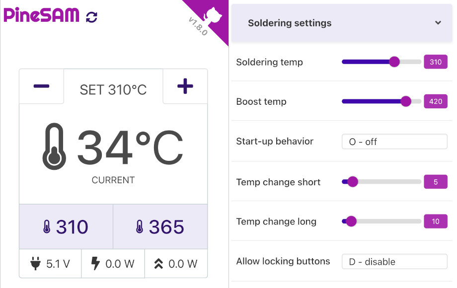
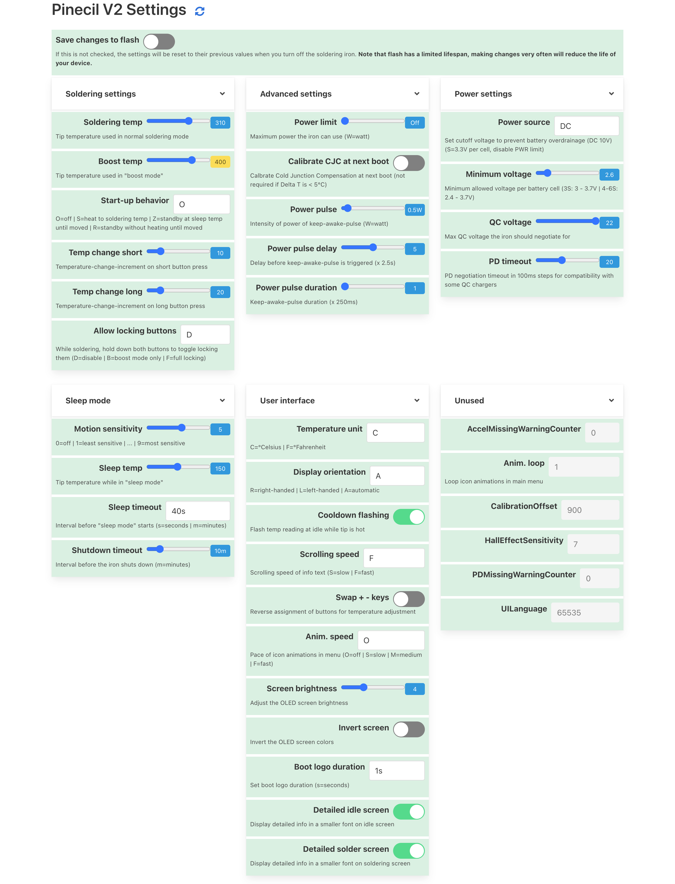

[](https://hits.seeyoufarm.com)


[](https://github.com/builder555/PineSAM/releases/latest)
<br><br>
 <br><br>
***
<br>



PineSAM = Pinecil Settings and Menus

Why focus on soldering when you can play with the settings instead? With this app you have full control over your new shiny Pinecil V2 from your computer using bluetooth.


**NB**: No special browser BLE GATT or flags required and works on all major OS/devices.

**NB**: This app needs the python backend to run on a computer, it CANNOT run entirely in the browser like Joric's UI.

<details>
  <summary>Full settings view</summary>
  <p>
    
  </p>
</details>
<div style="clear:both;">&nbsp;</div>

# Features

- [x] Automatically detect Pinecil V2 over BLE bluetooth.
- [x] Get all settings from V2.
- [X] Show hints toggle button for help messsages.
- [X] Modify settings and validate values before sending to V2.
- [X] Save to flash toggle button to commit setting changes directly to V2 (leave off for Work view to save flash cycles).
- [X] Work View main screen with: Set °C/°F `[+][-]` buttons, live tip °C/°F updates, peak watts, live watts, input voltage.
- [X] Custom Preset buttons to allow quick change of user defined temperatures (PineSAM extra feature not available directly inside Pinecil).
- [X] Backend runs locally on all major platforms/OS while the User Interface runs on your favorite browser.
- [X] Temperature automatically adjusts based on °C or °F setting.
- [X] Hide Minimum Voltage (per cell) when source is not battery.

## Platforms
 | System  | Windows | MacOS | Linux | iOS | Android|
 | :-----: | :-----: | :---: | :---: | :-: | :----: |
 | backend |:heavy_check_mark:|:heavy_check_mark:|:heavy_check_mark:|
 | UI      |:heavy_check_mark:|:heavy_check_mark:|:heavy_check_mark:|:heavy_check_mark:|:heavy_check_mark:|
<br>

# Install Options

## I. Using pre-made binaries

1. Does not require installation of python or node.js
2. Download latest [release](https://github.com/builder555/PineSAM/releases/latest) version for your OS system (Mac, Linux, Windows).
3. **Mac/Linux**: extract and run `./start.sh` in terminal.
4. **Windows**: 
   * right click on the zip, properties> general, check box to Unblock.
   * Run powershell as admin `.\start.ps1`
   * Allow any windows pop-up warnings about "serve.exe" and "main_sever.exe".
   * If you get errors in powershell, set the permissions to RemoteSigned to allow scripts (reference: [permission errors](https://lazyadmin.nl/powershell/running-scripts-is-disabled-on-this-system/)).
   * ```Set-ExecutionPolicy RemoteSigned```

5. See [Known Issues](https://github.com/builder555/PineSAM/Readme.md#known-issues) below or the [Discussions](https://github.com/builder555/PineSAM/discussions) if you run into problems.

## II. Install the Dev version (Source-all-xxx)
### A. Install these to run the backend script
- python 3 (tested with 3.10/3.11)
- pipenv
- [node+npm](https://nodejs.org/en/download/)
#### UI
- runs on any browser (IE is not a browser)

### B. Using Dev version on Mac/Linux

### Install

```shell
git clone https://github.com/builder555/PineSAM
cd PineSAM
chmod +x setup-dev.sh
chmod +x run-dev.sh
./setup-dev.sh
```

### Run
```shell
./run-dev.sh
# press CTRL+C in the terminal window to stop
```

* On a Mac http://localhost:8080 will open in your browser automatically. On some linux distros you may need to do it manually.
* For Debian 12 hints, see [this post](https://github.com/builder555/PineSAM/discussions/47#discussion-4884758).
* See [Known Issues](https://github.com/builder555/PineSAM/Readme.md#known-issues) below or the [Discussions](https://github.com/builder555/PineSAM/discussions) if you run into problems.


### C. Using Dev version on Windows

### Install
If you already have Python and NodeJS installed, you can skip to step 3.

1. Install Python: https://www.python.org/downloads
    * Check "Add python.exe to PATH" and select "Customize Installation"
    * Check "Add Python to environment variables" option
    * See a reference screen [here](https://github.com/builder555/PineSAM/discussions/7#discussion-4862766).
2. Install NodeJS: https://nodejs.org/en/download/
3. Download the Source-all-xxx from the latest release: https://github.com/builder555/PineSAM/releases/latest
4. Right click the zip and open Properties > General tab and check _Unblock_ if it appears at the bottom. Then Unzip it.
5. Run powershell as administrator, [set permissions](https://lazyadmin.nl/powershell/running-scripts-is-disabled-on-this-system/)
```shell
# setting this one time in powershell normally persists on reboots.
Set-ExecutionPolicy RemoteSigned
```
### Run
1. Change directory, `cd` to the location of the PineSAM folder that was unzipped above.
```shell
setup-dev.bat   # only need to run this one time for each new version
run-dev.bat     # run this command every time you use Pinecil
```
2. See [Known Issues](https://github.com/builder555/PineSAM/Readme.md#known-issues) below or the [Discussions](https://github.com/builder555/PineSAM/discussions) if you run into problems.


## III. Remote access

You can access the settings remotely (i.e, from a phone) once the app is running on the main PC/laptop. All devices need to be on the same network.

* Find the [local IP address](https://lifehacker.com/how-to-find-your-local-and-external-ip-address-5833108) of the device running the app.
* open `http://<ip-address>:8080/` on the second device on the same network (i.e. phone).
* this works to run PineSAM on an iPhone or Android if you don't want to install python on the phone.
* Pinecil needs to be within BLE range of the computer running the PineSAM app; the 2nd device/phone just needs to be within Wifi/network range of the main computer.

## IV. Known issues
1. bleak causes Python to crash on Mac: https://github.com/hbldh/bleak/issues/768
    * possible solution: give access to iTerm (or whichever terminal you use) to Bluetooth in Settings
2. Pinecil not detected
    * possible solution: you paired your Pinecil using system settings - unpair it from all other places.
    * possible solution: need to [flash](https://github.com/Ralim/IronOS/discussions/1518#discussioncomment-4866637) [BLE firmware](https://github.com/builder555/PineSAM/files/10797411/Pinecilv2_EN.zip)
    * upcoming Ralim's IronOS 2.21 will be the first stable release that has BLE support built-in for V2. Before 2.21, only beta BLE versions of IronOS firmware will work.
    
3. Windows Powershell permissions issue
    * windows by default does not allow any scripts to run in powershell. Make sure the zip file property is _Unblock_ and execute in powershell ([reference](https://lazyadmin.nl/powershell/running-scripts-is-disabled-on-this-system/)):<br>
    `set-executionpolicy remotesigned`
    * check that windows has not reset the permissions in powershell with `Get-ExecutionPolicy` and change it back to `RemoteSigned`.


## Testing

```shell
# run inside 'backend' directory:
pipenv run test
```

## References

- [Pinecil](https://wiki.pine64.org/wiki/Pinecil) - The Pinecil Wiki page
- [IronOS](https://github.com/Ralim/IronOS) - The OS running on this soldering iron
- [Pinecil Web UI](https://github.com/joric/pinecil) - A neat web-based UI, requires bluetooth browser support
- [Pinecil Authenticity Checker](https://pinecil.pine64.org/) - almost all AliExpress Pinecils are fake, check your V2!
