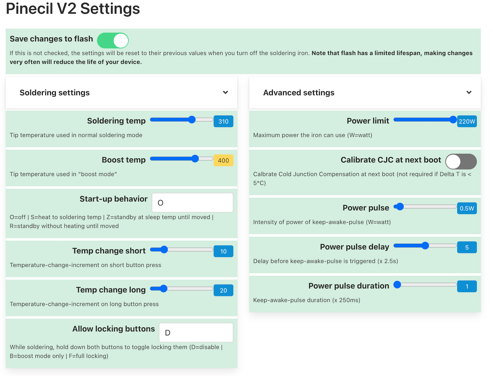
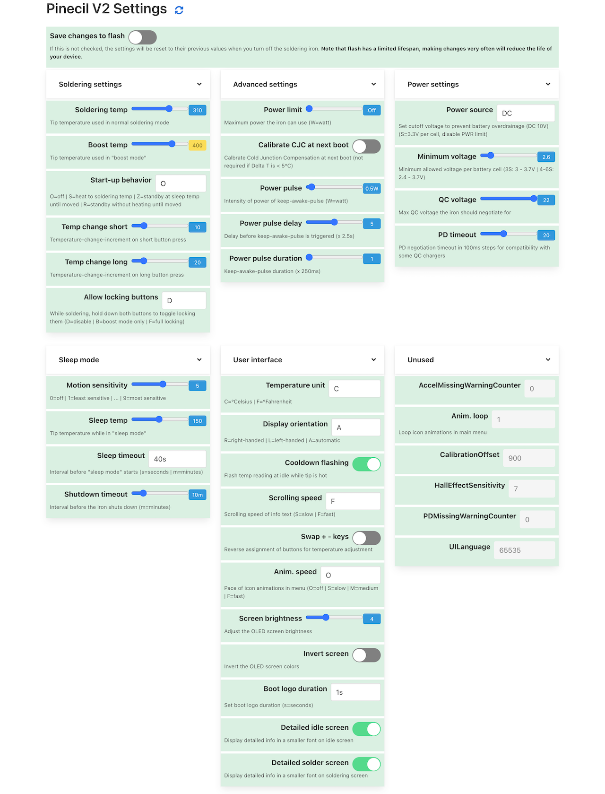

# Pinecil V2 settings

Why focus on soldering when you can play with the settings instead? With this app you will have full control over your new shiny Pinecil V2 from your computer using bluetooth.

**NB**: No special browser permissions required

**NB**: This app needs the python backend to run on a computer, it CANNOT run entirely in the browser unlike Joric's UI.

<details>
  <summary>Full settings view</summary>
  <p>
    
  </p>
</details>
<div style="clear:both;">&nbsp;</div>

## Features
- [x] Automatically detect Pinecil V2 over BLE
- [x] Get all setting values
- [X] Modify settings
- [X] Adjust temperature ranges based on C/F selection
- [X] Hide Minimum Voltage (per cell) when source is DC
- [X] Validate setting values before sending to device

## Requirements:

- python 3 (tested with 3.10)
- pipenv
- a browser

## Mac/Linux 

### Install

```shell
git clone https://github.com/builder555/pinecil-v2
cd pinecil-v2/backend
pipenv install
chmod +x start.sh
```

### Run
```shell
# from inside the pinecil-v2/backend directory:
./start.sh
```

On a Mac http://localhost:8080/settings.html will open in your browser automatically. On linux you need to do it manually (for now).

## Windows

If you already have python installed, you can skip to step 2.

1. Install Python: https://www.python.org/downloads
    * Select "Customize Installation"
    * Check "Add Python to environment variables" option
    * See a reference screen [here](https://github.com/builder555/pinecil-v2/discussions/7#discussion-4862766) Thanks to [River-b](https://github.com/River-b)
2. Download this repo: https://github.com/builder555/pinecil-v2/archive/master.zip
3. Unzip it
4. Run `start.bat` file inside the `backend` directory

---

## Remote access

You can access the settings remotely once the app is running

* Find the [local IP address](https://lifehacker.com/how-to-find-your-local-and-external-ip-address-5833108) of the device running the app
* open http://\<ip-address\>:8080/settings.html on another device on the same network

## Known issues

- bleak causes Python to crash on Mac: https://github.com/hbldh/bleak/issues/768
    * possible solution: give access to iTerm (or whichever terminal you use) to Bluetooth in Settings
- Pinecil not detected
    * possible solution: need to [flash](https://github.com/Ralim/IronOS/discussions/1518#discussioncomment-4866637) [BLE firmware](https://github.com/Ralim/IronOS/discussions/1449#discussioncomment-4866655)
- Setting change is not reflected on the soldering iron
    * some changes require entering the menu on the device itself (or power cycle after saving to flash) before appearing. [Example](https://github.com/Ralim/IronOS/issues/1560)
    
## References

- [Pinecil](https://www.pine64.org/pinecil/) - The Pinecil homepage
- [IronOS](https://github.com/Ralim/IronOS) - The OS running on this soldering iron
- [Pinecil Web UI](https://github.com/joric/pinecil) - A neat web-based UI, requires bluetooth browser support
- [Pinecil Authenticity Checker](https://pinecil.pine64.org/) - Almost all AliExpress Pinecils are fake, check yours!
