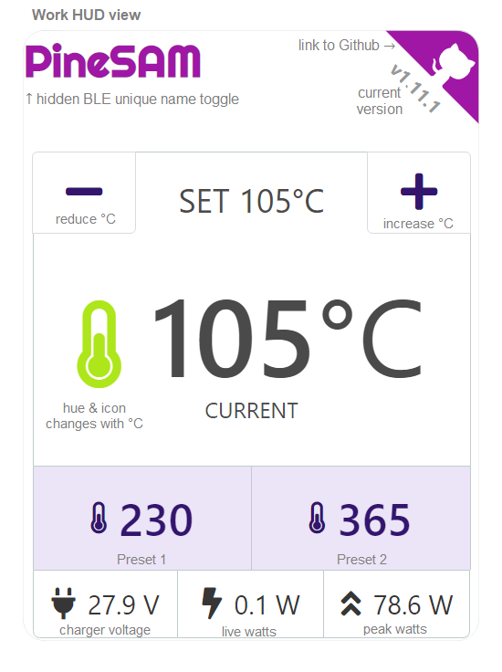

# Work HUD View

1. This is a HUD window designed as an all-in-one single view that can be used during soldering.
2. Phone: designed to be completely viewable on vertical screen.
3. In this view one can control Set temperature with buttons +/- and view important stats, e.g., live temperature.
4. Power Bar: bottom bar shows the input voltage, the current estimated watts pinecil is drawing, and the highest peak watt hit during the session.
5. It is best to leave save to flash toggle Off while using the Work HUD to save on pinecil flash cycles as the PineSAM buttons are used often during a soldering session.

## Preset buttons

1. Allows quick change of user customizable temperatures (exclusive to PineSAM and not available on Pinecil iron directly).
2. Preset buttons can be customized and saved instantly to desired temperature.
3. Presets are saved to the html file where the python script is running and will persist if one uses the same PC again.

### Steps:

1. set the number desired with the PineSAM [-][+] buttons.
2. then long hold the Preset 1/2 you want to save to, click OK on the confirmation box.
3. it will save what is currently shown in the Set °C at the top.
