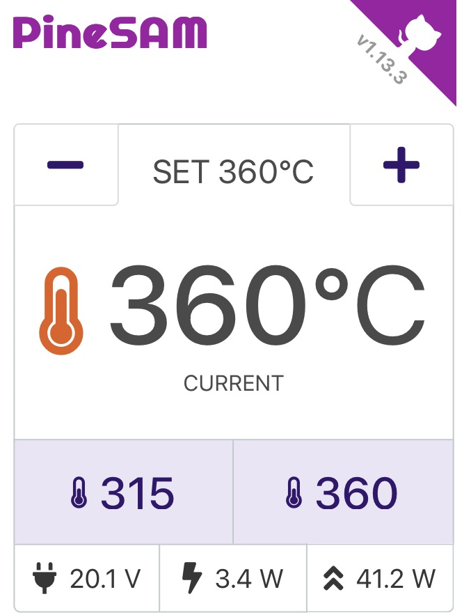
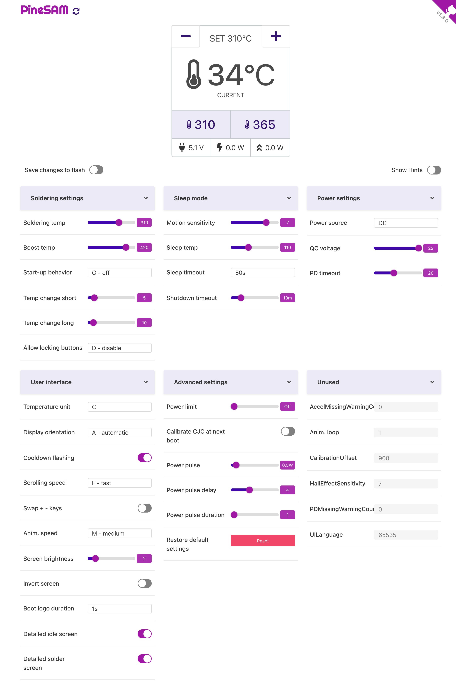

{ align=left width=350  float="left" }
# Pinecil Settings and Menus
Why focus on soldering when you can play with the settings instead? With this app you have full control over your new shiny Pinecil V2 from your computer using bluetooth.

**NB:** No special browser flags or BLE GATT required; works on all major OS and phones.

**NB:** This app needs the backend to start on a computer terminal; then the user interface runs from any browser. It CANNOT run entirely by only opening a browser like Joric's UI.

??? info "Full settings view"
    
    

## Supports
 | System  | :material-apple: MacOS   | :simple-linux: Linux  | :material-microsoft-windows: Windows | :material-cellphone-wireless: Phones |
 | :-----: | :-----: | :----: | :-----: | :---: |
 | UI      |:octicons-check-16:|:octicons-check-16:|:octicons-check-16:|:octicons-check-16:|
 | backend |:octicons-check-16:|:octicons-check-16:|:octicons-check-16:|       |

## :material-format-list-group: Features

-  Automatically detect Pinecil V2 over BLE.
- Control all settings on the device.
-  Save to Flash: toggle to save changes directly onto Pinecil (leave off unless actively changing settings).
-  Work HUD main screen has: buttons ++plus++ ++minus++ to change temperature, live updates, peak and live watts, input voltage.
-  Preset buttons allow quick change of user defined temperatures (PineSAM extra feature not available directly inside Pinecil).
-  Backend runs locally on all major platforms/OS while the user interface runs on your favorite browser.

## :material-cellphone-nfc: Remote access

You can access the settings remotely once the app is running on the main PC/laptop.

* Find the [local IP address](https://lifehacker.com/how-to-find-your-local-and-external-ip-address-5833108) of the computer running the app.
* Open `http://<ip-address>:8080/` on the second device on the same network (e.g., a phone).
* Pinecil needs to be within BLE range of the computer running the PineSAM app.
* Hint: if your pc is on a LAN, then also enable the wifi on it, and use that IP Address on the phone's browser.

## :octicons-book-24: References

- [Pinecil](https://wiki.pine64.org/wiki/Pinecil) - The Pinecil Wiki page
- [IronOS](https://github.com/Ralim/IronOS) - The OS running on this soldering iron
- [Pinecil Web UI](https://github.com/joric/pinecil) - A neat web-based UI, requires bluetooth browser support
- [Pinecil Authenticity Checker](https://pinecil.pine64.org/) - almost all AliExpress Pinecils are fake, check your V2!

## :octicons-star-24: Contributors

Help is welcome at all levels from coding to a cup of coffee, please see [here](about.md).

